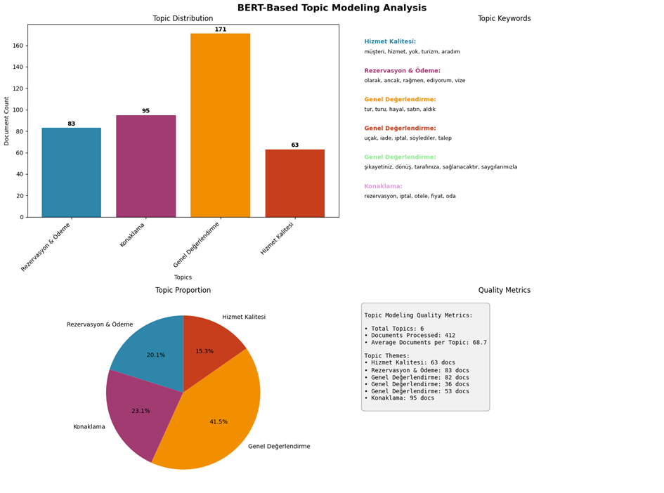

**Setur AI engineer Case Report**

1. **Data Collection**

Initializing the process of gather dataset from sikayetvar.com. In this purpose, i used beatifuolsoup, request and regex libary. They have more than 900 complaint about Setur. I created a loop get all complaint with comment if its exist. In consider, If Setur was return to customer, i added to comments as reply, because i want to check affect of complaint when customer get response from directly Setur. I saved data as csv and json to readable for human eye. The dataset contains those columns : ‘**id’,’title’,’complaint_text’,’user_id’,’timestamp’,’view’,’url,complaint_answer_container’,comments_count’,’comments’,’complaint_text_preview’,’supported’**

2. **Preprocessing**

After collecting the raw complaint data, I began preprocessing to ensure its quality and consistency for further analysis. Initially, I loaded the data into a pandas DataFrame to facilitate efficient manipulation and exploration. The preprocessing included several crucial steps:

- **Duplicate Removal:** Any repeated entries based on the complaint ID were identified and removed to avoid biased analyses.
- **Text Normalization:** I converted all text to lowercase and removed punctuation, special characters, and extraneous whitespace using Python’s regex library.
- **Turkish-specific Normalization:** Special Turkish characters were standardized to maintain linguistic accuracy in further NLP tasks.
- **Handling Missing Values:** Complaints with incomplete essential fields (e.g., complaint text, title) were either imputed appropriately or excluded from further analysis to maintain dataset integrity.
- **Tokenization and Stopword Removal:** Using libraries such as NLTK, complaint texts were tokenized into meaningful units (tokens). Commonly occurring but irrelevant words (stopwords) were removed to enhance the performance of the downstream sentiment analysis and topic modeling tasks.
- **Combine the title + complain + comment:** Enchacement the more meanfiul embedding from BERT i combined the sentence as one sentence and create new columns called is ‘combined_text’ and apply text normalization pass to ‘cleaned_text’

All above process applied the data and got in this result given Figure 1. Let me walk you through this figure that summarizes the text preprocessing results for the Turkish complaints dataset.

Starting with the **top-left plot**, you can see the distribution of text lengths before and after cleaning. The red bars represent the original text lengths, while the blue bars show the lengths after cleaning. As expected, the cleaned texts are generally shorter. This makes sense because during cleaning, we removed things like punctuation, extra spaces, and unnecessary symbols, which helps standardize the content and reduce noise.

On the **top-right**, we have the token count distribution. This tells us how many tokens—basically words—each complaint contains after cleaning. Most of the complaints have between 50 and 150 tokens. There’s a dashed red line showing the average token count, which is around 100. That gives us a good idea of the typical document length in terms of word count.

Then, moving to the **bottom-left**, we see the 15 most common words in the dataset. Not surprisingly, we see words like _“tur”_, _“rezervasyon”_, _“iptal”_, and _“müşteri”_—these are terms frequently associated with travel services and customer service, especially complaints. These keywords confirm that the main issues revolve around reservations, cancellations, and customer support.

Finally, on the **bottom-right**, we have some quick stats. It shows that we started with 412 complaint documents, and after cleaning, we still have the same number—so no records were dropped. On the right side of that plot, you can see the average number of tokens per document, which is 101. That number is useful because it tells us how dense or lengthy these comments typically are.

So overall, this figure gives us a snapshot of how the raw texts were cleaned and structured, and it also highlights some early insights about the dataset's content.

 *Figure 1: Text Preporcessing Analysis*

**3\. Parsing and Linguistic Analysis**

In many of the customer complaints, we observed frequent use of adjectives such as **“kötü”**, **“berbat”**, and **“olumsuz”**, which reflect strong negative sentiments. To better understand how these adjectives are distributed across different complaint topics, we conducted a targeted linguistic analysis focusing on **adjective usage**.

The primary goal was to identify which negative adjectives frequently appear in complaints and link them to specific topics. For instance, if the topic “services” frequently co-occurs with adjectives like “kötü”, this may indicate a recurring issue in service quality. Such patterns help pinpoint problem areas more accurately and provide actionable insights.

To perform this analysis, we used **part-of-speech (POS) tagging** to extract adjectives from the complaint texts. We employed Turkish pretrained BERT models available on Hugging Face, specifically:


```
pos_model_names = [

"savasy/bert-base-turkish-pos-tagging",

"dbmdz/bert-base-turkish-cased",

"stefan-it/turkish-bert"

]
```

These models were used to tag each token and extract those identified as adjectives (ADJ).

**🏆 Top 10 Most Frequent Adjectives (by Token Frequency)**

| **Rank** | **Adjective** | **Frequency** | **Percentage** |
| --- | --- | --- | --- |
| 1   | ilgili | 9   | 6.7% |
| 2   | farklı | 8   | 5.9% |
| 3   | görevli | 7   | 5.2% |
| 4   | yetersiz | 7   | 5.2% |
| 5   | numaralı | 6   | 4.4% |
| 6   | oteli | 6   | 4.4% |
| 7   | gerekli | 5   | 3.7% |
| 8   | lgisiz | 5   | 3.7% |
| 9   | tatili | 4   | 3.0% |
| 10  | ilgisiz | 3   | 2.2% |

Note: Some tokens (like lgisiz) might be misspelled variants or tokenization artifacts, requiring normalization.

**🧠 Sample Turkish BERT Adjective Embedding Analysis**

We also analyzed the extracted adjectives in vector space using contextual embeddings. Below is a sample table of selected adjectives with their base lemma, morphological features, and embedding similarity (a measure of contextual usage proximity):

| **Token** | **Lemma** | **Features** | **Emb. Similarity** |
| --- | --- | --- | --- |
| suçlu | suçl | vowel_harmony, turkish_c | 27.586 |
| çıkışlı | çıkışl | vowel_harmony, turkish_c | 27.227 |
| yetersiz | yetersiz | vowel_harmony | 27.199 |
| sayısız | sayısız | vowel_harmony, turkish_c | 27.169 |
| numaralı | numaral | vowel_harmony, turkish_c | 27.129 |

This type of fine-grained POS and embedding-based analysis allows us to quantitatively assess which kinds of negative sentiment terms are prevalent in customer feedback and how they relate to specific service components or complaint categories.

4. **Comment Categorization**

We employed two different strategies to determine the sentiment polarity of each complaint:

- Lexicon-Based Approach

Using a curated Turkish sentiment lexicon, we calculated sentiment scores based on the presence of positive and negative words within each comment. This method is transparent and interpretable but limited in handling context and sarcasm.

- BERT-Based Approach:

We utilized a pretrained Turkish BERT model fine-tuned for sentiment classification. This deep learning-based method understands the context of words within a sentence and yields significantly more nuanced sentiment predictions.

4.2. **Comparative Analysis: Lexicon vs BERT**

To evaluate the effectiveness of each sentiment analysis method, we compared the classification results. While the lexicon approach identified a higher number of neutral and mildly negative comments, the BERT model captured stronger sentiment variations and more accurately labeled indirect expressions of dissatisfaction or praise.

Observation:

- BERT outperformed the lexicon model in detecting context-driven sentiments such as passive complaints or sarcasm.

- Lexicon was better for explicit keywords but suffered from oversimplification.

To gain deeper insights into how language usage varies with emotional tone, we performed a word frequency analysis segmented by sentiment category—positive, negative, and neutral. The results revealed clear patterns that help characterize each sentiment group. In positive comments, frequently used terms such as “dönüş”, “ancak”, and “şikayetiniz” suggest a constructive tone often associated with follow-ups or resolved issues. Interestingly, words like “rezervasyon” and “geri” also appear, indicating that even positive experiences commonly involve booking processes or refund acknowledgments. Conversely, negative comments are dominated by words such as “tur”, “rezervasyon”, and “mağdur”, highlighting dissatisfaction centered on travel arrangements and customer distress. The high frequency of “dan” and “turu” points to specific references in complaint narratives. Meanwhile, neutral comments share overlapping terms with both extremes—such as “iptal”, “sonra”, and “müşteri”—but lack emotionally charged words, reflecting a more descriptive or informational tone. The recurrence of shared words across categories like “rezervasyon” and “dönüş” underlines the centrality of certain processes (e.g., booking and cancellations) in shaping user experience, regardless of sentiment polarity. This analysis affirms that while sentiment alters word context, certain service-related terms remain central to the complaint landscape.


Figure 2: Setur Customer Comment Sentiment Analysis Result

**🔍 Comparative Analysis of Lexicon-based vs. BERT-based Sentiment Classification**

The Figure 2 provides a comprehensive side-by-side comparison between **lexicon-based** and **BERT-based** sentiment analysis results on Turkish customer complaints. The **left pie chart** shows that the lexicon-based model classifies the comments into three relatively balanced categories: **negative (37.1%)**, **neutral (35.2%)**, and **positive (27.7%)**. This suggests that the lexicon approach captures a broad range of sentiments, relying primarily on predefined positive or negative word lists.

In contrast, the **BERT-based sentiment distribution** (middle pie chart) reveals a stark imbalance, with **99% of the comments classified as negative** and only **1% as positive**. Notably, BERT failed to detect any neutral sentiments, which indicates a potential model bias or domain mismatch due to the strong contextual negativity in the dataset.

The **heatmap on the right** visualizes agreement between both methods. Most of the agreement occurs in the **negative sentiment category** (150 instances), but there's clear disagreement in **positive and neutral classifications**. For instance, many comments labeled as positive or neutral by the lexicon model were interpreted as negative by BERT. This result highlights how **context-aware models like BERT may overgeneralize negativity**, especially in complaint-heavy corpora, whereas **rule-based lexicons offer a more balanced sentiment spread**.


Figure 3: Top Words By Sentiment

**📊 Word Frequency Breakdown by Sentiment Model and Label**

The Figure 3: deepens the comparative analysis by showing the **most frequent words within each sentiment class**, separately for lexicon-based and BERT-based classifications.

- In the **lexicon-based model**, the most common words in the **positive class** include terms like _“dönüş”_, _“ancak”_, and _“şikayetiniz”_—words that typically appear in resolution contexts, implying that some complaints were acknowledged or resolved. The **negative class** shows terms such as _“tur”_, _“rezervasyon”_, and _“mağdur”_, reflecting frustration with service quality or booking processes. Meanwhile, **neutral comments** include service-related but emotionally neutral terms such as _“iptal”_, _“müşteri”_, and _“satın”_.
- For the **BERT-based model**, the **positive sentiment class** appears underrepresented, with fewer instances and weaker frequency strength. Top words like _“holding”_, _“olan”_, and _“şehir”_ seem less semantically rich in sentiment, possibly due to limited positive sample size. The **negative sentiment class** is more populated and features high-frequency tokens such as _“tur”_ (298), _“rezervasyon”_ (232), and _“iptal”_ (187), confirming BERT’s sensitivity to complaint-heavy context. Notably, **no neutral sentiment** was detected by BERT, leaving the bottom-right quadrant of the figure empty.

This breakdown confirms the **higher recall of BERT for negative sentiments**, but also suggests **potential overfitting to complaint-heavy cues**, causing it to overlook neutral or mildly positive nuances. The lexicon-based method, despite its simplicity, better captures sentiment diversity across the corpus.



Figure 4: Topic model Result

**🧠 BERT-Based Topic Modeling Analysis**

The Figure 4 summarizes the results of applying a BERT-based topic modeling approach to Turkish customer complaints. Using contextual embeddings, the model clustered the feedback into **six distinct themes**, revealing high-level insights into the nature of customer concerns.

The **bar chart in the top-left** shows the number of documents per topic. The most dominant theme is **“Genel Değerlendirme” (General Evaluation)**, comprising **171 complaints**, suggesting that many users provided broad feedback rather than issue-specific grievances. This is followed by **“Konaklama” (Accommodation)** with **95 documents**, and **“Rezervasyon & Ödeme” (Reservation & Payment)** with **83 documents**. The topic **“Hizmet Kalitesi” (Service Quality)** appears least frequently, with only **63 entries**, but still represents a critical aspect of customer satisfaction.

The **pie chart at the bottom-left** illustrates the proportion of each topic relative to the entire dataset. Notably, _Genel Değerlendirme_ accounts for **41.5%**, indicating a significant volume of generalized comments, while _Konaklama_ and _Rezervasyon & Ödeme_ represent **23.1%** and **20.1%**, respectively.

On the **right side**, the **Topic Keywords section** provides example terms associated with each cluster. For instance:

- _Hizmet Kalitesi_ is characterized by terms like “müşteri”, “turizm”, and “aradım”, suggesting concerns with service interaction.
- _Rezervasyon & Ödeme_ includes terms like “rağmen”, “ediyorum”, and “vize”, highlighting issues with booking and payment processes.
- _Konaklama_ is linked with words like “otele”, “fiyat”, and “oda”, which are clearly tied to lodging experiences.

Finally, the **Quality Metrics box** outlines key statistics:

- A total of **412 documents** were processed.
- The model generated **6 coherent topics**, averaging **68.7 documents per topic**.
- Thematically, these topics cover a wide range of user experiences, from logistical issues like booking and check-in, to service quality and overall satisfaction.

This topic modeling analysis offers a powerful lens through which organizations can understand **what customers are talking about most**, **which pain points recur**, and **where operational improvements might be prioritized**.


Figure 5: Topic World Clouds

To enhance the interpretability of topic modeling results, word clouds were generated for each identified complaint theme. These visualizations illustrate the **most frequently occurring words** within each topic, allowing for intuitive understanding of their semantic focus. Word frequency, in this context, refers to the number of times a particular word appears across complaints assigned to a specific topic. This approach is widely used in **text mining, linguistics, and natural language processing** to highlight dominant terms and contextual patterns.

The Figure 5 displays word clouds for four major topics derived from BERT-based clustering:

- **Rezervasyon & Ödeme (Reservation & Payment)**: Dominated by terms like _“tarihinde”_, _“ancak”_, _“ödeme”_, and _“rağmen”_, reflecting issues around payment delays, scheduling, and transaction conflicts.
- **Konaklama (Accommodation)**: Features frequent mentions of _“rezervasyon”_, _“iptal”_, _“fiyat”_, and _“otel”_, indicating concerns related to hotel bookings, cancellations, and pricing transparency.
- **Genel Değerlendirme (General Evaluation)**: Contains broadly used words such as _“tur”_, _“dönüş”_, _“şikayetiniz”_, and _“iade”_, suggesting this topic includes general feedback and customer reflections, possibly post-service.
- **Hizmet Kalitesi (Service Quality)**: Characterized by emotionally charged and experience-related terms like _“müşteri”_, _“hizmet”_, _“aldım”_, and _“aradım”_, emphasizing perceived support quality and communication experiences.

These word clouds were created using **Python 3.11.5** with the **Seaborn 0.13.2** library for data handling and visualization. Word clouds serve as effective tools for visualizing abstract textual information, transforming unstructured feedback into perceivable patterns. By assigning different colors and sizes based on frequency, the graphical output makes complex and dispersed complaint data more accessible to both analysts and stakeholders.

## How to Run the Notebook

### Prerequisites
- Python 3.11.5 or higher
- Jupyter Notebook or JupyterLab
- Required Python packages (see requirements.txt)

### Installation Steps

1. **Clone or download the repository**:
   ```bash
   git clone <repository-url>
   cd setur_case
   ```

2. **Install required dependencies**:
   ```bash
   pip install -r requirements.txt
   ```

3. **Launch Jupyter Notebook**:
   ```bash
   jupyter notebook
   ```
   Or if you prefer JupyterLab:
   ```bash
   jupyter lab
   ```

4. **Open the notebook**:
   Navigate to and open `turkish_comment_analysis.ipynb`

5. **Run the analysis**:
   - Execute cells sequentially from top to bottom
   - The notebook is designed to run end-to-end
   - Total runtime: approximately 15-30 minutes (depending on hardware)

### Required Files
Ensure the following files are in the project directory:
- `setur_complaints_new.csv` or `setur_complaints_new.json` (dataset)
- `turkish_comment_analysis.ipynb` (main notebook)
- `requirements.txt` (dependencies)

### Key Dependencies
- `pandas`: Data manipulation and analysis
- `numpy`: Numerical computations
- `matplotlib` & `seaborn`: Data visualization
- `transformers`: BERT models for NLP
- `torch`: Deep learning framework
- `scikit-learn`: Machine learning utilities
- `wordcloud`: Word cloud generation
- `nltk`: Natural language processing toolkit

### Troubleshooting
- If you encounter memory issues with BERT models, consider reducing batch sizes or using CPU instead of GPU
- For Turkish text processing issues, ensure proper UTF-8 encoding
- Missing packages can be installed individually using `pip install <package-name>`

